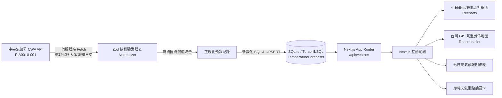

# 🇹🇼 Taiwan Weather Forecast 台灣天氣預報 GIS Dashboard

> **從氣象資料到互動式天氣預報全端應用**  
> 一個可正式部署至 **Vercel** 的台灣七天天氣預報全端網頁系統，串接交通部中央氣象署（CWA）Open Data API，支援六大區域與 22 縣市氣候走勢、降雨機率預估、雙溫折線圖、七日預報明細與互動式 Leaflet GIS 氣溫色階地圖。

---

## 📑 目錄
1. [專案目的與特色](#-專案目的與特色)
2. [系統架構圖](#-系統架構圖)
3. [技術堆疊](#-技術堆疊)
4. [CWA 資料來源與解析策略](#-cwa-資料來源與解析策略)
5. [資料庫 Schema (SQLite / libSQL)](#-資料庫-schema)
6. [API 路由設計](#-api-路由設計)
7. [台灣 GIS 地圖氣溫色階圖例](#-台灣-gis-地圖氣溫色階圖例)
8. [本機安裝與執行](#-本機安裝與執行)
9. [自動化測試](#-自動化測試)
10. [Vercel 正式環境部署教學](#-vercel-正式環境部署教學)
11. [Vercel Cron 定時同步設定](#-vercel-cron-定時同步設定)
12. [資安防護與常見問題排查](#-資安防護與常見問題排查)

---

## 🎯 專案目的與特色

本專案旨在將氣象開放資料透過現代化 Web 技術與資料工程管線，轉換為直覺、專業且高互動性的氣象 GIS 儀表板：
- **完整支援台灣 22 縣市**：包含本島 19 縣市與澎湖、金門、連江 3 離島。
- **標準化 CWA「臺」格式**：統一城市命名標準（如「臺中市」、「臺北市」）。
- **伺服器端資料保護**：所有 CWA API 請求皆由 Route Handler 代為處理，前端網路封包與原始碼絕不洩漏金鑰。
- **無縫離線備援**：內建完整 22 縣市 7 日氣象 Mock 資料集，即使氣象署 API 斷線或未配置金鑰，系統仍可正常展示。
- **響應式全端體驗**：完美支援桌面端 (1440px)、平板 (768px) 與手機螢幕 (390px)。

---

## 🏗️ 系統架構圖



---

## 💻 技術堆疊

| 領域 | 使用技術 | 說明 |
| :--- | :--- | :--- |
| **前端框架** | Next.js 15 (App Router) + React 19 | 兼具 SSR 效能與 Client 互動 |
| **開發語言** | TypeScript 5.7+ | 嚴格靜態型別定義與型別安全 |
| **樣式設計** | Tailwind CSS + Lucide React | 現代化清爽卡片 UI 與豐富天氣圖示 |
| **資料驗證** | Zod 3.24+ | 外部 CWA 巢狀 JSON 容錯解析 |
| **資料庫** | `@libsql/client` (SQLite / Turso) | 支援本機檔案式與 Vercel 雲端分散式 SQL |
| **趨勢圖表** | Recharts 2.15+ | 響應式雙線 MinT / MaxT 溫度折線圖 |
| **GIS 地圖** | Leaflet 1.9 + React Leaflet 5 | 動態載入台灣 22 縣市氣溫標記地圖 |
| **單元測試** | Vitest + Testing Library | 涵蓋正規化、SQL UPSERT、API 權限測試 |
| **雲端部署** | Vercel Serverless | 全球 CDN 與邊緣優化部署 |

---

## 📡 CWA 資料來源與解析策略

### 資料集資訊
- **主要資料集**：`F-A0010-001`（臺灣一週天氣預報）
- **API Base URL**：`https://opendata.cwa.gov.tw/api/v1/rest/datastore/`
- **時區轉換**：使用台灣時區 `Asia/Taipei` 對齊日期 (`YYYY-MM-DD`)。

### 巢狀解析策略
1. **多格式相容**：自動兼容 `records.location` 與 `records.locations.location` 巢狀陣列。
2. **時間對齊鍵值聚合**：使用 `startTime` 與 `endTime` 作為合併基準，非盲目按陣列索引配對。
3. **安全容錯機制**：當 `MinT`、`MaxT` 或 `PoP` 缺失或非數值格式時，安全回傳 `null`，計算 `avgT = (minT + maxT) / 2` 絕不造成介面崩潰。

---

## 🗄️ 資料庫 Schema

本專案使用 SQLite 相容之 `TemperatureForecasts` 表：

```sql
CREATE TABLE IF NOT EXISTS TemperatureForecasts (
  id INTEGER PRIMARY KEY AUTOINCREMENT,
  regionName TEXT NOT NULL,
  locationName TEXT NOT NULL,
  dataDate TEXT NOT NULL,
  startTime TEXT NOT NULL,
  endTime TEXT NOT NULL,
  minT REAL,
  maxT REAL,
  avgT REAL,
  weather TEXT,
  weatherCode TEXT,
  precipitationProbability REAL,
  comfort TEXT,
  fetchedAt TEXT NOT NULL
);

-- 唯一索引：確保多次同步時自動更新（UPSERT），不產生重複資料
CREATE UNIQUE INDEX IF NOT EXISTS idx_temp_forecast_unique 
ON TemperatureForecasts (locationName, dataDate, startTime, endTime);

CREATE INDEX IF NOT EXISTS idx_temp_forecast_query 
ON TemperatureForecasts (regionName, locationName, dataDate);
```

---

## 🔌 API 路由設計

### 1. `GET /api/weather`
- **Query 參數**：
  - `location`：指定縣市（例如 `臺中市`）
  - `region`：指定區域（例如 `中部地區`）
  - `date`：指定日期（例如 `2026-10-05`）
- **回傳範例**：
  ```json
  {
    "ok": true,
    "data": [...],
    "summary": [...],
    "selectedCity": "臺中市",
    "selectedDate": "2026-10-05",
    "availableDates": ["2026-10-05", "2026-10-06", ...],
    "totalRecords": 308,
    "updatedAt": "2026-10-05T09:54:00.000Z",
    "isFallback": false
  }
  ```

### 2. `POST /api/weather/sync`
- **認證方式**：`Authorization: Bearer <SYNC_SECRET>`（若有設定環境變數）
- **功能**：由伺服器向 CWA 抓取最新資料並執行 UPSERT 寫入資料庫。
- **速率限制**：內建 10 秒冷卻保護防重複呼叫。

### 3. `GET /api/health`
- **功能**：健康檢查與資料庫連線監測，不洩漏任何敏感金鑰。

---

## 🗺️ 台灣 GIS 地圖氣溫色階圖例

地圖上的 22 縣市圓形標記會依據**當日預估平均氣溫**動態著色：

| 氣溫區間 | 顏色代表 | 視覺呈現 |
| :--- | :--- | :--- |
| **< 20°C** | 藍色 (`#3b82f6`) | 寒意 / 低溫 |
| **20–25°C** | 綠色 (`#10b981`) | 舒適 / 溫和 |
| **25–30°C** | 黃/橙色 (`#f59e0b`) | 溫暖 / 微熱 |
| **> 30°C** | 紅色 (`#ef4444`) | 炎熱 / 高溫 |
| **無資料** | 灰色 (`#9ca3af`) | 暫無即時紀錄 |

點擊地圖上的圓點或彈出視窗（Popup）按鈕，儀表板將立即同步切換至該縣市！

---

## 🚀 本機安裝與執行

### 1. 複製專案與安裝套件
```bash
git clone https://github.com/damondtsai/AIIS_1005_tw_weather_forecast.git
cd AIIS_1005_tw_weather_forecast
npm install
```

### 2. 配置環境變數
建立 `.env.local` 檔案（可參考 `.env.example`）：
```bash
CWA_API_KEY=your_cwa_api_key_here
CWA_DATASET_ID=F-A0010-001
DATABASE_URL=file:weather.db
SYNC_SECRET=my_local_sync_secret_2026
```
*(若暫無 CWA 金鑰，系統會自動切換為本地 22 縣市離線 Mock 預報資料集)*

### 3. 啟動開發伺服器
```bash
npm run dev
```
瀏覽器開啟 `http://localhost:3000` 即可預覽。

---

## 🧪 自動化測試

執行完整單元測試與整合測試（包含正規化器、區域對照、UPSERT 與 API 端點）：
```bash
npm test
```

執行 ESLint 程式碼品質檢查：
```bash
npm run lint
```

執行正式環境建置測試：
```bash
npm run build
```

---

## ☁️ Vercel 正式環境部署教學

### 步驟 1：建立 Turso 雲端 SQLite 資料庫 (推薦)
1. 前往 [Turso.tech](https://turso.tech) 註冊並建立資料庫：
   ```bash
   turso db create tw-weather-db
   turso db show tw-weather-db --url
   turso db tokens create tw-weather-db
   ```
2. 取得 `DATABASE_URL` (例如 `libsql://tw-weather-db-...turso.io`) 與 `DATABASE_AUTH_TOKEN`。

### 步驟 2：在 Vercel 匯入 GitHub 專案
1. 登入 [Vercel](https://vercel.com)，點選 **Add New Project**。
2. 選擇 GitHub 倉庫 `damondtsai/AIIS_1005_tw_weather_forecast`。
3. Framework Preset 選擇 **Next.js**。

### 步驟 3：設定 Vercel 環境變數 (Environment Variables)
在 Vercel 專案 Settings -> Environment Variables 填入：
- `CWA_API_KEY`：中央氣象署 API 金鑰
- `CWA_DATASET_ID`：`F-A0010-001`
- `DATABASE_URL`：Turso 資料庫 URL
- `DATABASE_AUTH_TOKEN`：Turso 認證權杖
- `SYNC_SECRET`：自訂隨機同步金鑰

### 步驟 4：觸發 Deploy 部署
點選 **Deploy**，部署完成後即可獲得正式公開網址。

---

## ⏰ Vercel Cron 定時同步設定

若要在 Vercel 上每 60 分鐘自動同步一次氣象資料，可在專案根目錄建立 `vercel.json`：

```json
{
  "crons": [
    {
      "path": "/api/weather/sync",
      "schedule": "0 * * * *"
    }
  ]
}
```

> **注意**：Vercel Cron 呼叫時會帶有專用 Header，建議在 API Route 中驗證 `CRON_SECRET` 或 `SYNC_SECRET`。

---

## 🔒 資安防護與常見問題排查

1. **嚴禁將 API Key 設為 `NEXT_PUBLIC_*`**：前端 JavaScript bundle 與 HTML 絕不能出現真實金鑰。
2. **防範 SQL Injection**：所有資料庫操作皆使用參數化查詢 (`?` 佔位符)。
3. **常見問題：地圖顯示破圖或 `window is not defined`？**
   - 本專案採用 Next.js `dynamic(() => import(...), { ssr: false })` 動態載入，已徹底解決 SSR 時找不到 `window` 物件的問題。
4. **常見問題：Vercel Serverless 無法寫入本機 `.db` 檔案？**
   - 本專案在未設定 Turso 時會自動導向 `/tmp/weather.db` 暫存目錄；正式上線建議搭配 Turso libSQL 保持跨實例持久化。

---

## 👨‍💻 作者與維護
- **開發者**：Damon Tsai
- **授權**：MIT License
